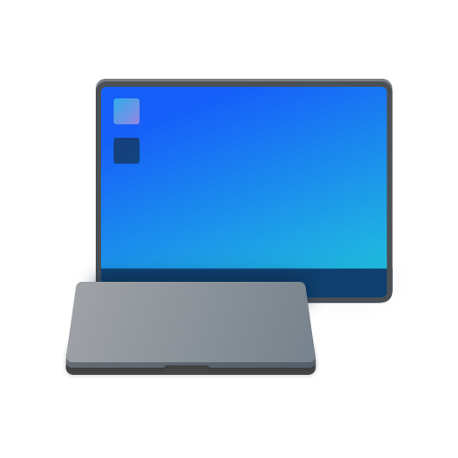

<p align="center">
  
</p>

<h1 align="center">LidDock</h1>

<p align="center">
  <strong>Intelligent macOS-style Clamshell Mode for Windows 11 laptops.</strong>
</p>

<p align="center">
  <a href="https://github.com/MeowIce/LidDock/releases/latest">
    
  </a>
  <a href="https://github.com/MeowIce/LidDock/releases">
    
  </a>
  <a href="https://discord.gg/wgYpZjgDvF">
    
  </a>
</p>

Still opening `Control Panel` -> `Hardware and Sound` -> `Power Options` -> `Choose what closing the lid does` twice every single day like it is 2006 ? Still baking your laptop because you forgot to revert "Do Nothing" back to "Sleep" before unplugging ? Hell nah

LidDock solves this forever. Just set it and forget it. It will do its job.


---

## What It Does

When an external monitor is plugged in, closing your laptop lid keeps your machine awake (Do Nothing).
When you unplug the monitor, your laptop automatically reverts to sleeping when closed (Sleep).

If an abrupt disconnect occurs while the lid remains closed (for example, kicking out your USB-C dock cable), LidDock activates a configurable Safety Grace Period (3 to 30 seconds). If no monitor reconnects within that window, it actively initiates system sleep via native Win32 `SetSuspendState` to eliminate overheating and battery drain.

---

## Features

- Zero Polling Event-Driven Architecture: Uses native Win32 Connecting and Configuring Displays (CCD) APIs (`QueryDisplayConfig`) and Power Setting Notifications (`GUID_LIDSWITCH_STATE_CHANGE`). Zero CPU consumption when idle.
- Extreme Efficiency: Consumes under 500KB (yes, Kilobyes, KB) in physical RAM.
- Fail-Safe Grace Period: Actively triggers system suspension if a dock or display is disconnected while the lid is closed.
- Profiles:
  - Smart Docked (Recommended): Automatic clamshell activation when docked to an external physical display, switching back to sleep when undocked.
  - AC Power Only: Clamshell mode restricted strictly to wall power connection to preserve battery health.
  - Always Clamshell: Clamshell mode remains active whenever an external monitor is attached, even on battery power.
- Fluent WinUI 3 Design: Settings interface styled after modern Windows 11 with Mica and Acrylic backdrops.
- Silent System Tray Daemon: Color-coded tray icon indicating docked and lid states with context menu controls.
- Automatic Update Checking: Background release checking against GitHub Releases with manual check triggers.
- In-Memory Diagnostics Ring Buffer: Thread-safe diagnostic logging and system state capture without disk wear.

---

## How to Use

### 1. First-Time Setup
- Download and run `LidDock-Setup.exe` from the [release page](https://github.com/MeowIce/LidDock/releases).
- During setup, keep **Launch LidDock automatically on Windows startup** checked (recommended) so LidDock runs silently in the background on boot.
- The Settings window opens automatically on first launch. Choose your preferred Profile under the Profiles tab (`Smart Docked` is recommended).

### 2. Daily Workflow
- **Docking**: Plug in your external monitor or USB-C/Thunderbolt dock, then close your laptop lid. Your display continues running smoothly on the external monitor without sleeping.
- **Undocking**: Unplug your cable. LidDock instantly restores standard Windows sleep behavior when closing the lid.
- **Accidental Disconnect**: If you unplug your dock while the lid is closed, LidDock's grace period countdown begins. If not reconnected within 5 to 10 seconds, it safely initiates system sleep to prevent overheating in laptop sleeves or bags.

### 3. System Tray Controls
- **Left-Click / Double-Click**: Opens the LidDock Settings window.
- **Right-Click Menu**: Quick access to toggle clamshell mode, switch operational profiles, open Diagnostics, check for updates, or exit the application.
- **Icon Status**:
  - Blue: Docked with lid open (external display connected, ready for clamshell).
  - Green: Clamshell active (external display connected, laptop lid closed and running).
  - Orange: Disconnect pending (safety grace period countdown active).
  - Gray: Undocked / Standard (no external display, normal sleep behavior).

---

## Architecture

LidDock is structured into modular layers:

- [LidDock.Core](src/LidDock.Core): Domain models, profile evaluation, state machine logic.
- [LidDock.Windows](src/LidDock.Windows): Low-level Win32 interop, CCD display queries, power scheme overrides, native message pump.
- [LidDock.Diagnostics](src/LidDock.Diagnostics): In-memory ring buffer logger and hardware snapshot diagnostics.
- [LidDock.Daemon](src/LidDock.Daemon): Native AOT background daemon and system tray coordination.
- [LidDock.App](src/LidDock.App): Fluent WPF user interface for configuration and diagnostics.
- [LidDock.Tests](tests/LidDock.Tests): Automated xUnit test suite for state machine transitions and safety triggers.

---

## Requirements

- Windows 11 (build 22000 or higher recommended)
- Inno Setup 6 (for packaging the installer)
- .NET 10.0 SDK & Desktop C++ tools (for building from source)

---

## Installation

1. Download `LidDock-Setup.exe` from [GitHub Releases](https://github.com/MeowIce/LidDock/releases).
2. Run `LidDock-Setup.exe` to install.
3. The installer sets up Start Menu shortcuts, desktop icons, optional Windows startup, and registers clean uninstallation support.

---

## Uninstallation

LidDock guarantees zero system residue:

1. Open **Windows Settings** -> **Apps** -> **Installed Apps** (or search **Uninstall LidDock** from Start Menu).
2. Select **Uninstall**.
3. The uninstaller automatically restores your original Windows Lid Close power scheme, removes startup registry entries, and cleans up all application data.

---

## Building from Source

Ensure .NET 10.0 SDK, Inno Setup 6, and MSVC C++ build tools are installed.

Clone the repository and run the build script:

```cmd
git clone https://github.com/MeowIce/LidDock.git
cd LidDock
build.bat
```

The build script will:
1. Publish the Fluent UI payload (`LidDock.App`) with full self-contained .NET 10 desktop runtime.
2. Compile the lean Native AOT background daemon (`LidDock.Daemon`).
3. Package both into the high-compression installer `publish\LidDock-Setup.exe` using Inno Setup 6 LZMA2.

To run automated unit tests:

```cmd
dotnet test
```

---

## Credits
- [@aprlnnf](https://t.me/aprlnnf) for the LidDock app icon.

---


## Star History

<p align="center">
  <a href="https://star-history.com/#MeowIce/LidDock&amp;Date">
    
  </a>
</p>

